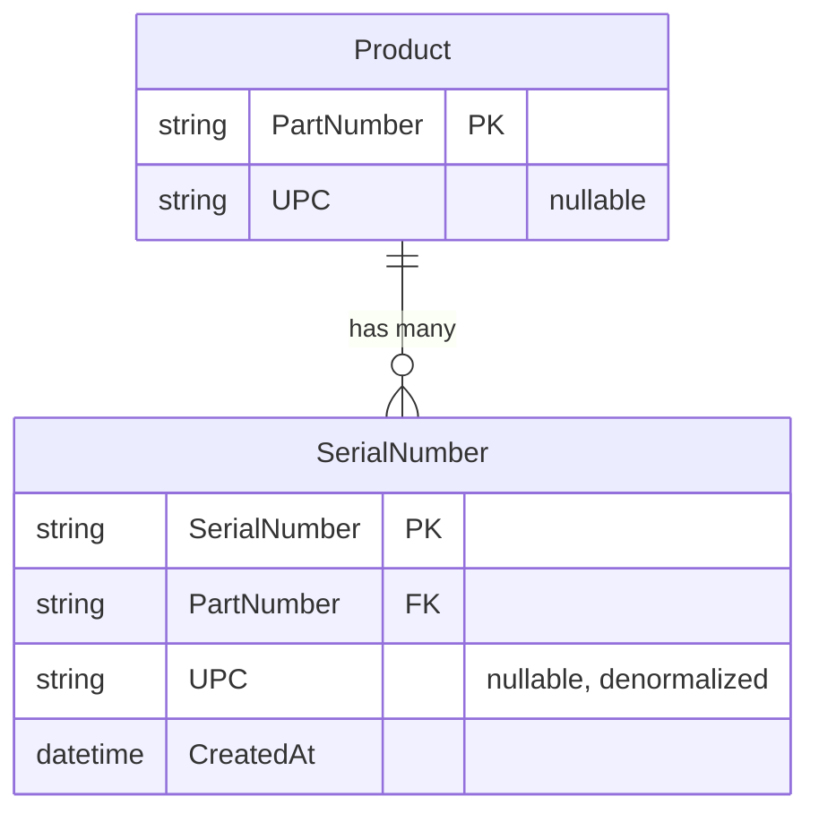
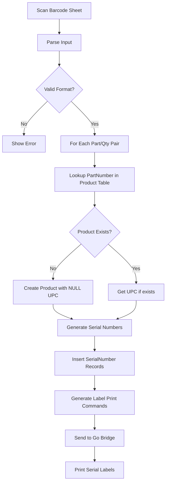
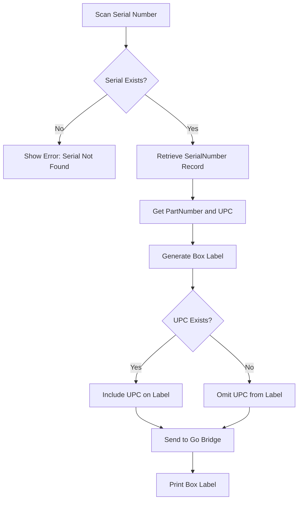
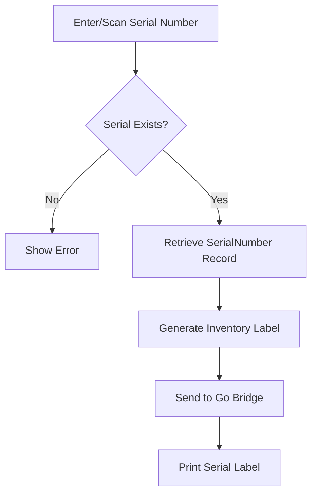

# LabelGen - Detailed Requirements

## 📋 Overview
LabelGen is an inventory management system that converts bulk barcode scans into sequential serial numbers and manages label printing for both inventory and shipping processes.

---

## 🗄️ Database Schema



### Table 1: `SerialNumber`
| Field | Type | Description |
|-------|------|-------------|
| SerialNumber | String (PK) | Sequential number (e.g., `000500`, `000501`) |
| PartNumber | String (FK) | Reference to Product |
| UPC | String (nullable) | Denormalized UPC for quick label printing |
| CreatedAt | DateTime | Timestamp of creation |

### Table 2: `Product`
| Field | Type | Description |
|-------|------|-------------|
| PartNumber | String (PK) | Unique part identifier (e.g., `232-9983`) |
| UPC | String (nullable) | Universal Product Code (optional) |

### Configuration Settings
- **Serial Number Start Position**: Configurable (default: `000500`)
- **Serial Number Digit Count**: Configurable (default: `6`, can be 10, 12, etc.)
- Leading zeros are **required** and preserved

---

## 🔄 Workflows

### Workflow 1: Bulk Serial Number Generation



**Input Format:**
```
232-9983
12
243-0012
1
343-0323
3
```
- Each line is a **separate barcode**
- Pattern: Part Number barcode, then Quantity barcode (alternating)
- System pairs consecutive scans: Part → Qty → Part → Qty
- Generates `QUANTITY` sequential serial numbers for each part

**Serial Number Generation:**
- Start at configurable position (default: `000500`)
- Digit count is configurable (default: 6, can be 10, 12, etc.)
- Increment sequentially: `000500`, `000501`, `000502`, etc.
- **Important:** Leading zeros must be preserved based on configured digit count

**Label Output:**
- Print only Serial Number on inventory label

---

### Workflow 2: Box Label Printing (Shipping)



**Label Output:**
- Serial Number
- Part Number
- UPC (only if it exists for that part)

---

### Workflow 3: Serial Number Reprint



---

## 🖥️ User Interface Pages

### 1. Bulk Serial Number Generation Page
**Route:** `/generate/` or `/bulk-scan/`

**Features:**
- **Hands-Free Scanning Interface:**
  - Starts with 2 empty rows (Part Number | Quantity)
  - Auto-focus on first input field
  - When Part Number scanned → auto-advance to Quantity field
  - When Quantity scanned → auto-advance to next Part Number field
  - **Dynamic row creation:** When first row filled, automatically add a new empty row
  - Continue pattern indefinitely (no touching keyboard/mouse required)
- Display live table showing captured entries:
  - Part Number
  - Quantity
  - Serial Range (e.g., `000500-000511`)
- "Generate & Print Labels" button (only needs click once all scanning complete)
- Error handling for invalid scans with visual/audio feedback

**Bulma Components:**
- `input` fields in `table` rows for Part/Qty pairs
- JavaScript for auto-focus and dynamic row addition
- `table is-striped` for preview/confirmation
- `button is-primary is-large` for final action
- `notification is-danger` for errors

---

### 2. Serial Number Reprint Page
**Route:** `/reprint/`

**Features:**
- Input field for serial number (manual or scan)
- Search button
- Display matching record details
- "Reprint Label" button
- History of recent reprints

**Bulma Components:**
- `input` with `control` wrapper
- `box` for record display
- `button is-info` for reprint

---

### 3. Box Label Print Page
**Route:** `/box-label/` or `/shipping/`

**Features:**
- Input field for serial number scan
- Auto-submit on enter/scan complete
- Display scanned item details (Serial, Part, UPC)
- "Print Box Label" button
- Recent scans list

**Bulma Components:**
- `input is-large` for scanning
- `card` for item details
- `table` for recent scans

---

### 4. Admin: UPC Management Page
**Route:** `/admin/upc/`

**Features:**
- Password protection (Django admin auth or custom)
- Two sections:
  1. **CSV Upload:**
     - File upload field
     - Expected format: `PartNumber,UPC`
     - Bulk import with validation
     - Preview before commit
  2. **Manual Entry/Edit:**
     - Table of all Product records
     - Inline editing for UPC field
     - Add new PartNumber/UPC pairs
     - Delete associations

**Bulma Components:**
- `file is-boxed` for upload
- `table is-hoverable is-striped` for data
- `input` inline for editing
- `modal` for confirmations

---

## 🎨 UI/UX Notes

### General Styling (Bulma.io)
- Clean, industrial aesthetic
- Large, scannable input fields
- Clear visual feedback for success/error states
- Responsive for tablet use in warehouse

### Color Scheme Suggestion
- Primary: Industrial blue (`is-link` or `is-primary`)
- Success: Green for successful scans
- Warning: Orange for missing UPC
- Danger: Red for errors

---

## 🖨️ Label Formats

### Inventory Label (Serial Only)
```
┌─────────────────┐
│                 │
│   [BARCODE]     │
│   000500        │
│                 │
└─────────────────┘
```

### Box Label (Shipping)
```
┌─────────────────────┐
│ Serial: 000500      │
│ Part: 232-9983      │
│ UPC: 012345678901   │ ← Only if exists
│                     │
│ [BARCODE: 000500]   │
│ [BARCODE: Part#]    │
│ [BARCODE: UPC]      │ ← Only if exists
└─────────────────────┘
```

---

## 🔐 Security & Validation

### Input Validation
- Part Number: Regex pattern `^\d{3}-\d{4}$` (format: XXX-XXXX)
- Quantity: Integer validation, must be positive
- Serial numbers: Must match configured digit count with leading zeros
- UPC: Optional, validate format if provided (typically 12 digits)
- Scan pairing: Must alternate Part → Qty → Part → Qty

### Admin Protection
- Password-protected UPC management page
- Consider Django's built-in admin authentication
- Log all UPC changes with timestamp and user

---

## 📊 Additional Features

### Configuration Management
- Serial number start position (editable in admin)
- Serial number digit count (editable in admin, default: 6)
- Current serial counter (auto-increment)
- Printer selection preferences

### Error Handling
- "Product not found" → Auto-create with NULL UPC
- "Serial number already exists" → Skip and warn
- "Go bridge not running" → Display clear error with retry option
- "Printer not found" → List available printers

### Reporting (Future Enhancement)
- Serial numbers generated per day
- Parts processed
- Reprint frequency
- UPC coverage percentage

---

## 🚀 Implementation Priority

1. ✅ Database models (Product, SerialNumber)
2. ✅ Serial number generation logic with configurable start
3. ✅ Bulk scan parser
4. ✅ Basic Bulma template setup
5. ✅ Bulk generation page
6. ✅ Box label page
7. ✅ Reprint page
8. ✅ Admin UPC management
9. ✅ Go bridge integration
10. ✅ Label template creation (format TBD based on printer type)
